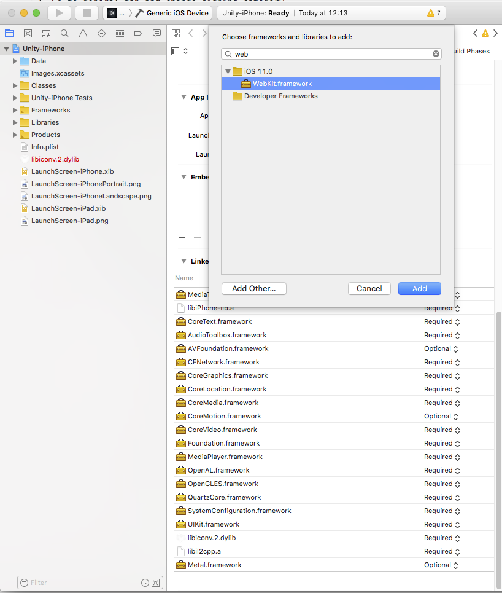

**Webview for Android and iOS**  
**Written by *Jae* 2018/01/11**

# Guide for iOS webview

1. Build iOS with Unity3D

2. When build process have been done then open xcodeproject which you just built

3. Go to General tab and change Signing category
- If you don't know about the password and how to do, please ask  check you email. As a Wizcorp memeber, you've already been received ID & password for it.
- You need a Apple develop ID & password

4. Add Webkit.framework in the general tab

5. Build Project & Test with a iOS device
- Press play button on the top menu bar

# Guide for Android webview

To make it run in Unity3D with Java code needs compiled .jar or .arr file.

1. Build webview android project with android studio
2. Go to project folder > builds > intermediates > bundles > debug
3. Find a classes.jar file and place the file into Unity3D > Plugins > Android
4. Build
5. Test (Use AVD or real android device)